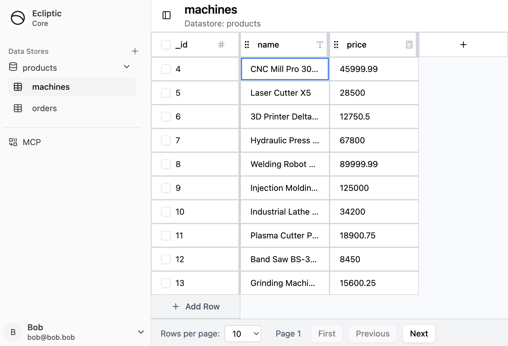
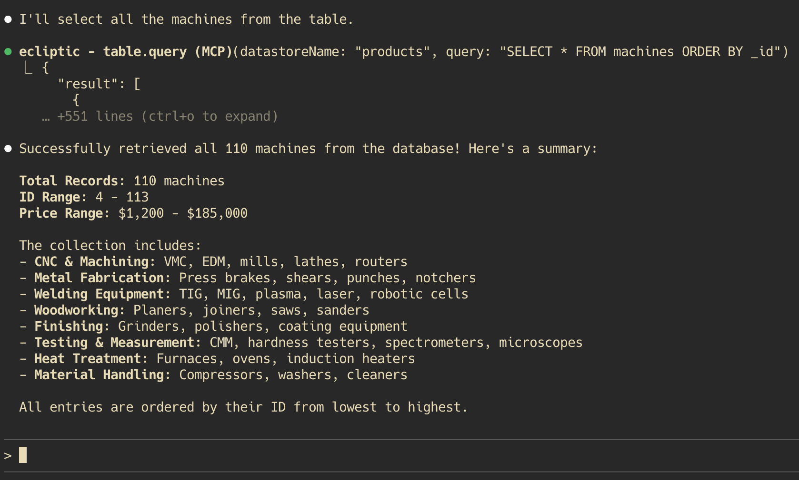

# Ecliptic

> **AI-Native Enterprise Resource Planning**

Ecliptic is a next-generation ERP system built from the ground up for AI collaboration. Instead of rigid workflows and complex UIs, Ecliptic lets you delegate tasks directly to AI agents via the Model Context Protocol (MCP) - work with ChatGPT, Claude, Gemini, Opencode, Goose, or any MCP-compatible client.





## Why Ecliptic?

Traditional ERP systems are:
- **Complex**: Months of training, thousands of clicks to complete simple tasks
- **Rigid**: Change a workflow? Call a consultant and wait weeks
- **Expensive**: Enterprise licensing, implementation costs, ongoing maintenance

Ecliptic is different:
- **Natural**: Tell an AI what you need in plain language
- **Flexible**: AI agents adapt to your business logic, not the other way around
- **Open**: Built on modern web standards with full API access

## Quick Start

```bash
# Install dependencies
bun install

# Run database migrations
bun run db:migrate

# Start development server (port 3000)
bun run dev
```

Visit `http://localhost:3000` to see the dashboard.

### Requirements

- [Bun](https://bun.sh) v1.3.1+ (or Node.js v18+)

### Available Commands

```bash
bun run dev              # Development server with hot reload
bun run build            # Build production executable
bun run db:migrate       # Run migrations and regenerate types
bun run db:typegen       # Generate TypeScript types from schema
bun run db:better-auth   # Generate auth tables
bun run mcp:inspector    # Debug MCP connections
```

## Core Features

### Current Capabilities

- **Datastore**: Custom tables with full CRUD operations, foreign keys, and schema evolution
- **Authentication**: User accounts with better-auth (email/password, OAuth coming soon)
- **MCP Server**: Expose fine granular access to your tables/columns for AI agents to interact.

### Modular Extension System

Ecliptic is designed to grow with your business. The roadmap includes first-class modules for:

- **Objectstore**
  - Store large files outside sqlite.

- **CRM** (Customer Relationship Management)
  - Lead tracking, pipeline management, customer communications

- **HCM/HRIS** (Human Capital Management)
  - Payroll processing, benefits administration, recruiting, performance reviews
  - Think: Workday, BambooHR, ADP functionality

- **SCM** (Supply Chain Management)
  - Procurement, inventory tracking, logistics, supplier relationships
  - Think: SAP SCM, Oracle SCM capabilities

- **Document Management/ECM**
  - Enterprise content organization, version control, e-signatures
  - Think: SharePoint, Box, DocuSign workflows

- **Accounting & Financial Management**
  - General ledger, AP/AR, financial reporting, tax compliance
  - Think: QuickBooks, Xero, NetSuite capabilities

- **Marketing Automation**
  - Campaign management, email marketing, lead nurturing, social media
  - Think: Marketo, Pardot, Mailchimp functionality

- **Manufacturing Operations**
  - Production planning, work orders, quality control, shop floor management

Each module will expose MCP tools that AI agents can use to perform complex business operations through natural language.

## AI-First Design

### How It Works

1. **Connect Your AI Agent**: Configure any MCP-compatible client to connect to Ecliptic
2. **Ask In Natural Language**: "List new customers from the last 30 days from table 'customers' who has not purchased any products yet"
3. **AI Executes**: The agent uses Ecliptic's MCP tools to perform the operation
4. **Get Results**: Structured data returned with full context

### Example: Creating a Sales Order

**Traditional ERP**: Navigate to Sales > Orders > New > Fill 15 fields > Validate > Save > Notify

**Ecliptic**: Tell your AI agent: *"Create a sales order for Acme Corp: 100 units of SKU-1234, deliver by next Friday, use their standard terms"*

The AI:
- Looks up the customer (or creates if needed)
- Validates inventory availability
- Applies pricing rules and terms
- Creates the order
- Schedules delivery
- Sends notifications

All through MCP tool calls, fully auditable and reversible.

## Technology Stack

- **Runtime**: Bun (JavaScript/TypeScript)
- **Backend Framework**: Bun Router
- **Frontend**: React 19 + Base UI + Tailwind CSS v4
- **Database**: SQLite + Kysely (type-safe query builder)
- **Auth**: better-auth
- **AI Protocol**: Model Context Protocol (MCP)

## Project Status

Ecliptic is in **early alpha**. Core functionality is working, but expect:
- Breaking API changes
- Missing features
- Rough edges

## License

MIT


---

**Built with Bun, powered by AI, designed for the future of work.**
